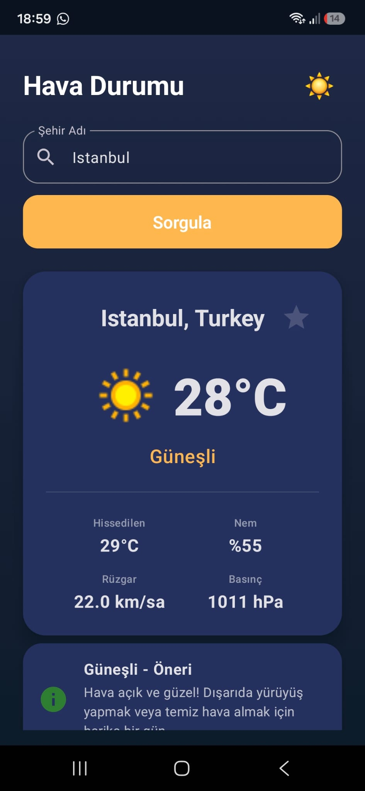
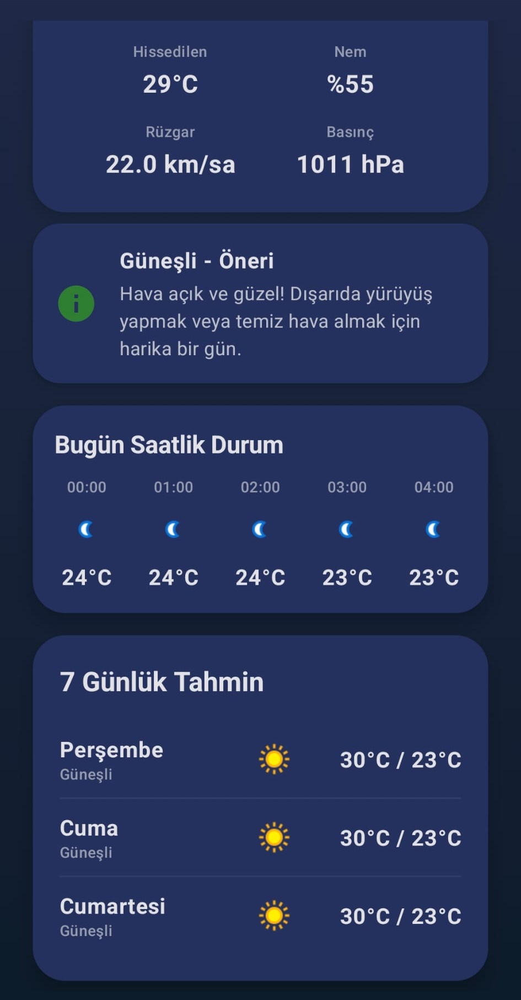
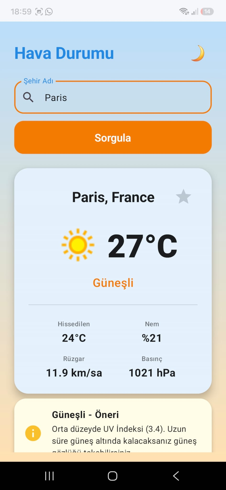
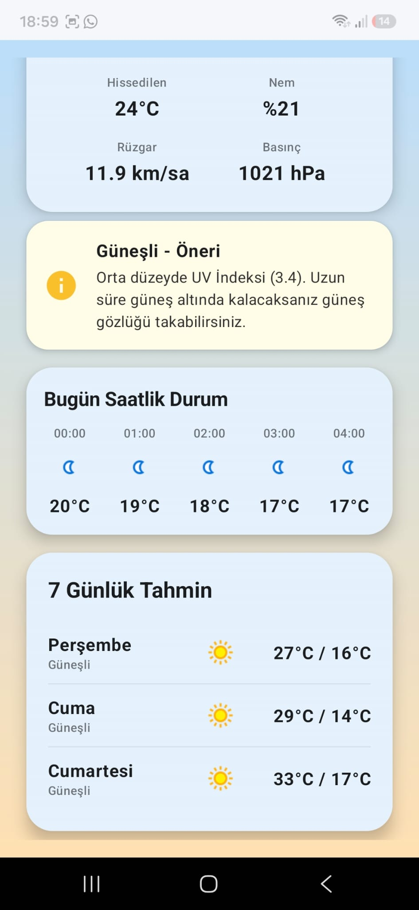
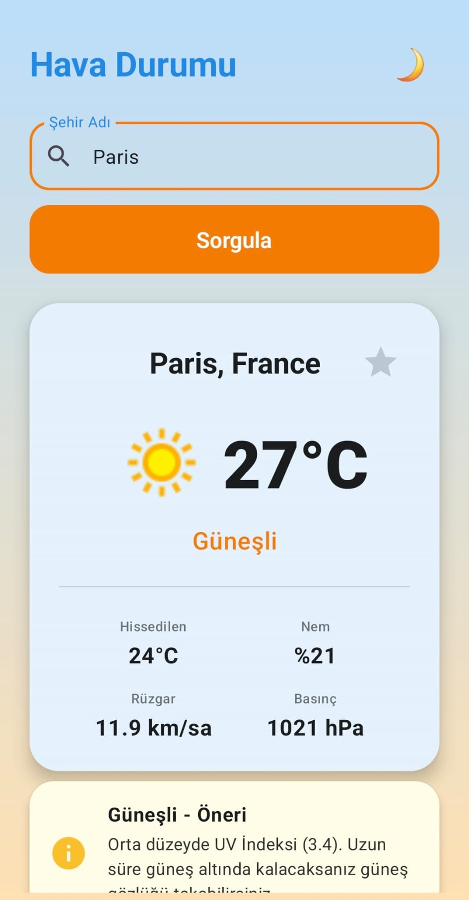
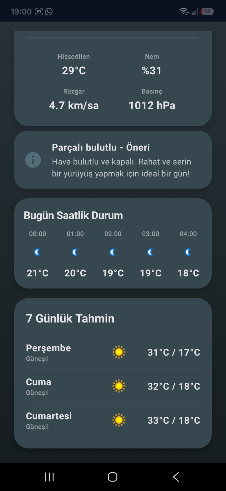

# 🌤️ Android Hava Durumu ve Takip Sistemi

---

## 📋 Proje Bilgileri

*   **Proje Yürütücüsü:** Selin Yılmaz
*   **Bölüm:** Bilgisayar Mühendisliği Öğrencisi
*   **Proje Adı:** Android Hava Durumu ve Takip Sistemi
*   **Platform:** Android (Kotlin)
*   **Arayüz Mimarisi:** Jetpack Compose & Material Design 3

---

## 🎯 Proje Özeti

Bu proje; harici bir hava durumu API'si üzerinden anlık sıcaklık, nem, basınç, rüzgar hızı ve UV indeksi gibi atmosferik verileri çekmek, kullanıcının GPS konumuna göre dinamik hava durumu sunmak ve akıllı bildirimlerle kullanıcıyı yönlendirmek için geliştirilmiş modern bir Android uygulamasıdır.

---

## ⚙️ Uygulama Ne Yapar? (Akış ve Özellikler)

*   **📍 Konum Tespiti:** Cihazın anlık GPS koordinatlarını alarak otomatik olarak yerel hava durumunu getirir. GPS kapalıyken veya konum izni verilmediğinde, uygulamanın stabil çalışabilmesi amacıyla varsayılan olarak **İstanbul**'u yükler (Fallback mechanism).
*   **🔔 Akıllı Öneri ve Bildirim Sistemi:** Hava koşullarına göre (Güneşli, Yağmurlu vb.) kullanıcıya özel tavsiyeler verir (Örneğin: yüksek UV indeksinde güneş gözlüğü takılması, yağmurlu havada şemsiye alınması gibi) ve `WorkManager` aracılığıyla arka planda periyodik olarak bildirimler tetikler.
*   **📊 Saatlik ve Günlük Tahmin:** Önümüzdeki saatlerin sıcaklık değişimlerini yatay kaydırılabilir şık bir çubukta gösterir ve 7 günlük detaylı tahmin raporlarını listeler.
*   **🎨 Dinamik Tema:** Hava durumunun türüne (Güneşli, Yağmurlu, Karlı, Fırtınalı) ve kullanıcı tercihine göre otomatik uyum sağlayan, durum çubuğuyla senkronize **Aydınlık/Karanlık Mod** desteği sunar.

---

## 🛠️ Teknolojiler

*   **Dil:** Kotlin
*   **Arayüz (UI):** Jetpack Compose, Material Design 3
*   **Veri Altyapısı:** REST API entegrasyonu (WeatherAPI, Retrofit & OkHttp)
*   **Arka Plan İşlemleri:** Jetpack WorkManager (Arka planda periyodik veri analizi ve yerel bildirim tetikleme)
*   **Mimari:** MVVM (Model-View-ViewModel), Kotlin Coroutines & StateFlow (Reaktif durum yönetimi)
*   **Yerel Hafıza:** SharedPreferences (Tema seçimi ve favori şehirlerin diske kaydedilmesi)
*   **IDE:** Android Studio

---

## 📸 Görsel Yolculuk (Ekran Görüntüleri)

Uygulamanın arayüz tasarımları, karanlık ve aydınlık temaları ile farklı şehirlerdeki dinamik görünümleri aşağıda listelenmiştir:

| 1. İstanbul (Karanlık Tema) | 2. İstanbul Saatlik/Haftalık Detaylar | 3. Ankara (Parçalı Bulutlu) |
|:---:|:---:|:---:|
|  |  |  |
| **4. Ankara Saatlik/Haftalık Detaylar** | **5. Paris (Aydınlık Tema)** | **6. Paris Saatlik/Haftalık Detaylar** |
|  |  |  |

---

## 📈 Beklenen Sonuç

Uygulama başarıyla çalıştırıldığında:
*   Anlık GPS konumuna veya arama çubuğundan girilen şehre ait güncel hava durumu verileri ekrana yansır.
*   Saatlik ve 7 günlük tahmin kartları akıcı bir şekilde listelenir.
*   Hava durumuna uygun akıllı öneri kartları dinamik olarak güncellenir ve arka plan servisleri ile bildirimler aktif hale gelir.

---

## 📄 Lisans

Bu proje **[MIT Lisansı](LICENSE)** altında lisanslanmıştır. Detaylı bilgi için lisans dosyasını inceleyebilirsiniz.

---

  <b>Geliştiren:</b> Selin Yılmaz  
  <i>Bilgisayar Mühendisliği Öğrencisi</i>

